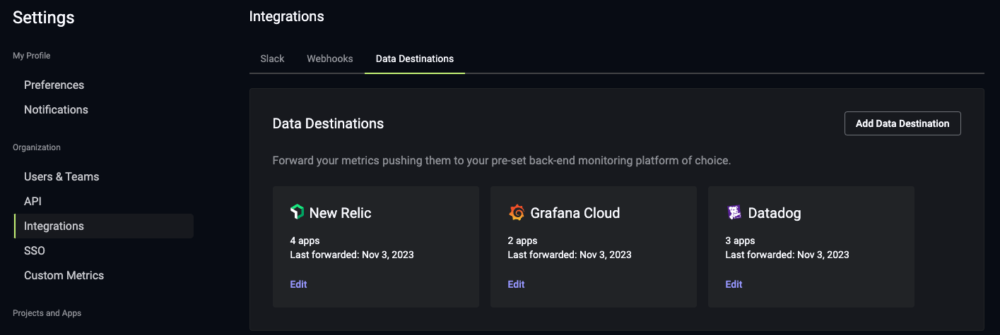
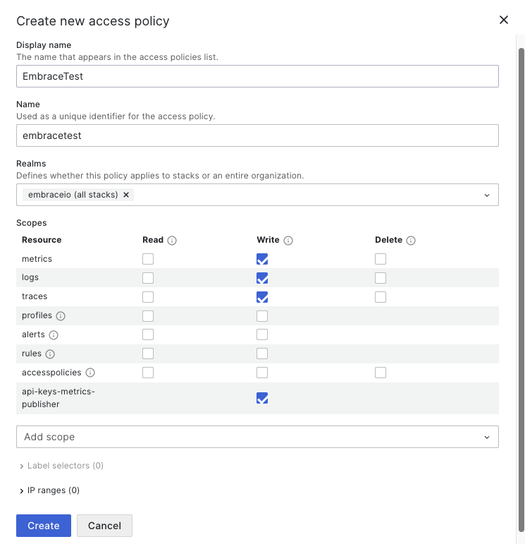
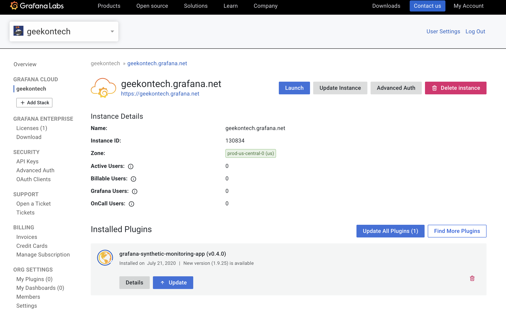

# Data Destinations

Embrace offers a number of Data Destinations to deliver your metrics to your cross-platform observability tool of choice. Foremost among these is Grafana Cloud.

All destinations receive a set of [Standard Metrics](./../../insights/dashboard-metrics/#standard-metrics) in daily, hourly, and five-minutely granularities:
- crash total
- sessions total

Additionally, Custom Metrics can be forwarded Grafana using Data Destinations in Embrace.

## Connecting Data Destinations to Grafana Cloud

To get started, head to Settings -> Integrations in the Embrace dashboard and add your first Data Destination:

### Grafana Cloud Access Policy

To proceed, you will need to create a new [Grafana Cloud Access Policy](https://grafana.com/docs/grafana-cloud/account-management/authentication-and-permissions/access-policies). When setting up the Access Policy, be sure to provide `write` permissions for `metrics`, `logs`, and `traces`. Additionally, you will need to add a new scope `api-keys-metrics-publisher` with `write` permissions:

### Instance ID and zone

After setting up the new Access Policy, log into your Grafana Cloud account to access the Cloud Portal. Click Details from the Grafana stack and copy the instance ID and zone. You will use this instance ID and zone when adding the Data Destination in the Embrace dashboard:

