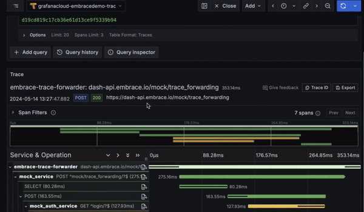
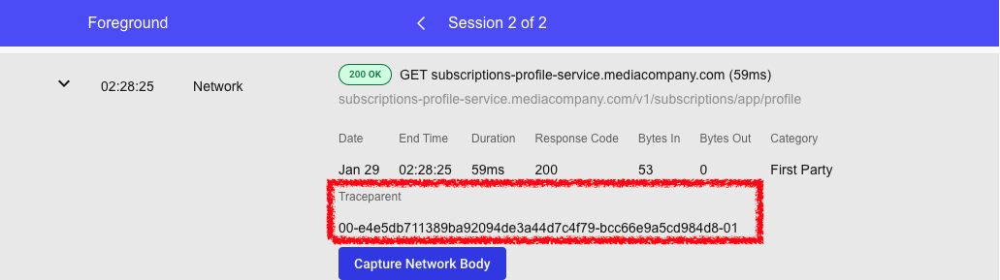
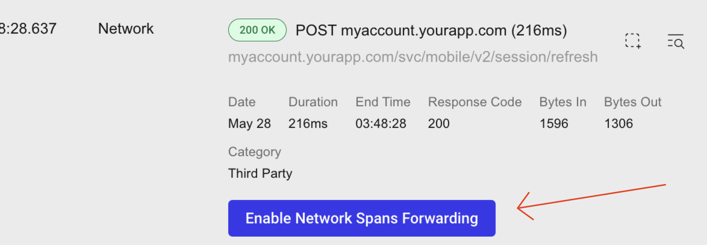

# End to end network requests

Diagnosing network errors doesn't need to be an opaque process with finger-pointing between mobile and backend teams. Use Embrace's **Network Span Forwarding** to tie it all into one picture.

<iframe width="560" height="315" src="https://www.youtube.com/embed/jJVlc8F89Qo?si=-udHrlujEMiTsOuV" title="YouTube video player" frameborder="0" allow="accelerometer; autoplay; clipboard-write; encrypted-media; gyroscope; picture-in-picture; web-share" referrerpolicy="strict-origin-when-cross-origin" allowfullscreen></iframe>

## ID every network request

Embrace can automatically add a unique identifier to every network request your app makes. This makes it possible to trace the same request in our User Timeline and the backend monitoring service you already use.

Network Span Forwarding use w3c traceparents to create unique identifiers, which means they will automatically propagate through the traces products of Grafana Cloud, Honeycomb, Datadog, New Relic, Chronosphere, and others. According to the w3c convention, you can use the trace-id portion of the traceparent to find your forwarded traces in the destination product.

Network Span Forwarding is configured remotely in the supported Embrace SDKs, so there is no client-side instrumentation to add once you have enabled the feature. You can determine what percentage of requests to send a traceparent for, and you can also specify the domains that Embrace should forward network spans for.

## Enable Network Spans Forwarding

To request Network Span Forwarding be turned on, simply click the "Enable Network Spans Forwarding" button next to any network requests on a User Timeline page.

## Requirements

NSF is supported on Embrace Android and Apple versions 6.x+. Accounts must also have a Data Destination set up for forwarding to Grafana.
