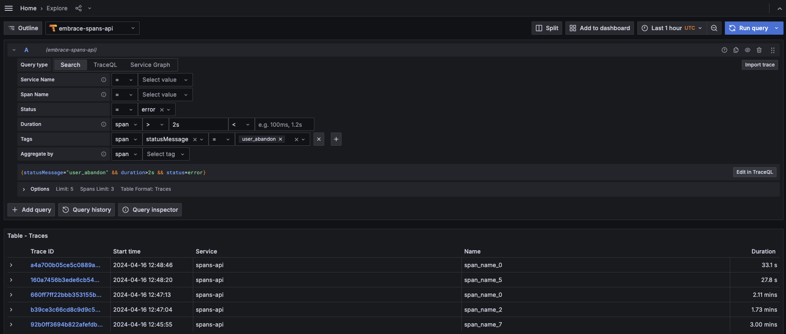
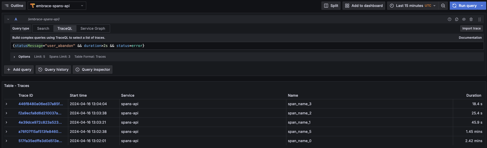

# Spans API

The Spans API allows you to query your spans using TraceQL, and thus is built to integrate directly into Grafana. The API implements the Tempo [HTTP API](https://grafana.com/docs/tempo/latest/api_docs/#tempo-http-api).

## Adding Spans API as a Data Source

To get started with Spans API, you will need an **Embrace Spans API Token**. This is a different token than the Metrics API token and from the Custom Metrics token. Once you have received this token from the Embrace team, proceed as follows:
- Click the gear icon to go to the Configurations page.
- Click on "Add data source" and select Tempo.
- Name your source `"embrace-spans-api"` and set the following fields:
- `URL: https://api.embrace.io/spans`
- Under Custom HTTP Headers, add a header with a name `Authorization` and use `Bearer <YOUR_API_TOKEN>` as your token string. If you don't have a token yet, you can use the sandbox token `dc8b04fb11874ee19a6ac1ced98da486`, and your token string should be `Bearer dc8b04fb11874ee19a6ac1ced98da486`.

## Exploring Spans Data

If you click on the "Explore" tab on Grafana's sidebar, and you select the "embrace-spans-api" data source, you can start querying your spans data. There are two modes you can do queries, the "Search" mode and the "TraceQL" mode.

### Search Mode

Here you can use the status dropdown to search for successful or error spans. You can also search using the tags, for example, using the `statusMessage` tag. On the Tags dropdown you will be able to select any attribute that is present in your spans data.

### TraceQL Mode

You can also search for spans using the [TraceQL query language](https://grafana.com/docs/tempo/latest/traceql/#query-with-traceql).

