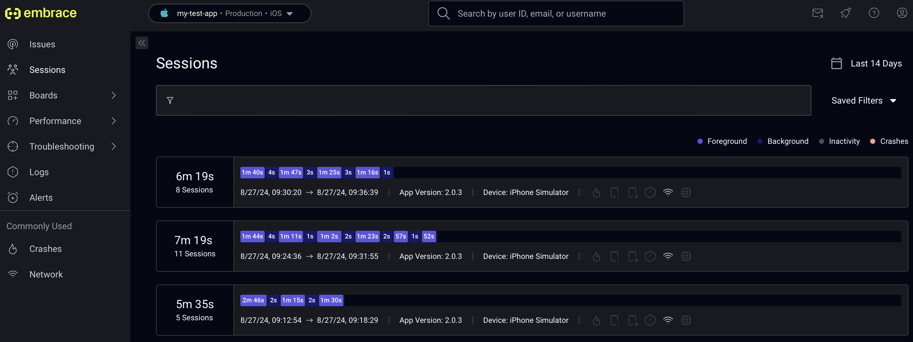

# Add the  SDK to your mobile app

# Overview

Once you've configured your app in the  dash, you should add the relevant mobile platform's SDK to your application. There are different integration steps for each platform, as outlined below.

 will test the integration when the SDK is added. You'll know that your integration works when you begin to see [session data](./../../mobile-signals/sessions/) in the  dashboard:

# Platform-specific instructions


Your App ID and API Token, created when you [configured your app](./../configure-app-in-embrace/), can be found in the settings page of your  dashboard.


You can find instructions for:
- [native Android SDK](./android/)
- [native Apple SDK](./iOS/)
- [hybrid SDKs](./hybrid-sdk/)
