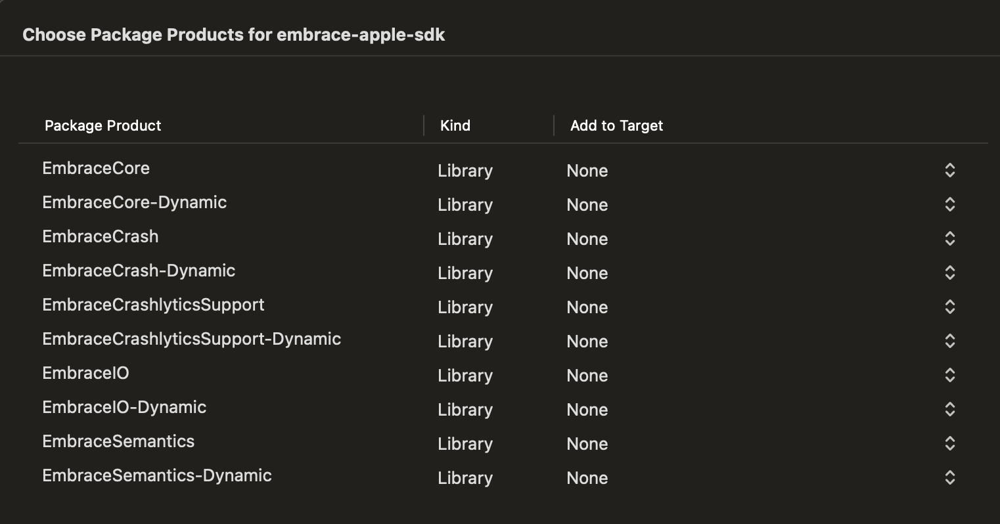

# Add the  iOS SDK to your mobile app

For native [iOS apps](https://embrace.io/docs/ios/open-source/), you will need to:

1. [Integrate](#integrate-the--param-product_name--apple-sdk) the  Apple SDK using the dependency manager of your choice
1. [Start](#starting-the-embrace-apple-sdk) the SDK within your app's source code.

## Integrate the  Apple SDK

You can integrate the  Apple SDK using either Swift Package Manager or CocoaPods. Additionally, you can pull down the [open-source repository](https://github.com/embrace-io/embrace-apple-sdk) and integrate it manually if your app requires a custom setup.

### Swift Package Manager

With Swift Package Manager, you can use Xcode to manage the Embrace dependency for you. 

Add a package dependency in Xcode. Select `File > Add Package Dependencies...` and enter the repository URL `https://github.com/embrace-io/embrace-apple-sdk.git` into the search bar.

 distributes each product statically and dynamically. For the most straightforward installation, select either `EmbraceIO` or `EmbraceIO-Dynamic` to add to your application target. For all other package products, do not add these to your target by selecting `None`.



Summary of these 5 products:

- `EmbraceIO` - This is the recommend product to install for quick integration. It provides a convenience layer over `EmbraceCore` to simplify the setup interface.
- `EmbraceCore` - This is the implementation of the Embrace SDK. If you'd like to customize your integration, this product allows you to.
- `EmbraceCrash` - This contains the Embrace Crash Reporter. This is a separate target for those apps that may not want crash reporting enabled, or may wish to use a separate crash reporter. It is included as a dependency of `EmbraceIO`, but not `EmbraceCore`.
- `EmbraceCrashlyticsSupport` - This enables [Firebase Crashlytics](https://firebase.google.com/docs/crashlytics) as the primary crash reporter. Embrace will continue to mirror reports sent to Crashlytics, ensuring that data is still available in the Embrace dashboard. This is an optional product for those who specifically need Crashlytics as their crash reporter but also want to leverage the Embrace dashboard.
- `EmbraceSemantics` - This module contains constants and attributes used internally to extend [OpenTelemetry Semantic Conventions](https://opentelemetry.io/docs/concepts/semantic-conventions/).

### CocoaPods

Add `EmbraceIO` to your Podfile will automate most of the integration process. Installing through CocoaPods is straightforward. Add the main pod to your Podfile:

```
pod 'EmbraceIO', '~> 6.3.0'
```
By default, this command installs all the necessary components to use the SDK.

## Starting the Embrace Apple SDK

After you have integrated the SDK, you will need to start the SDK in your app's code.  Apple SDK should be configured and started as close to the launch of the application as you are able to do so.

Below is an example launch for a straightforward SwiftUI application. It does the following:
1. imports the `EmbraceIO` package to add Embrace capabilities.
1. overrides the App's `init` method
1. configures the  Apple SDK with the `Embrace.setup` call
1. starts the configured SDK with the chained `.start()` call

```swift
import EmbraceIO
import SwiftUI

struct NewEmbraceApp: App {
    init() {
        do {
            try Embrace
                .setup(
                    options: Embrace.Options(
                        appId: //Your App ID from Embrace dash
                        // Other configuration options
                    )
                )
                .start()
        } catch let e {
            print("Error starting Embrace \(e.localizedDescription)")
        }
    }
}
```

A full list of configuration options are available in 's [iOS documentation](https://embrace.io/docs/ios/open-source/embrace-options/)
