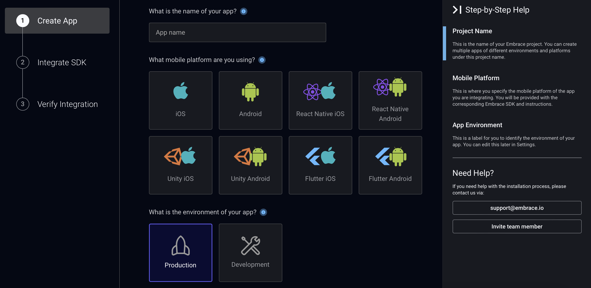

# Configure your app in the  dashboard

## Dashboard steps

Once you have [created an  account](./../create-account/), you can use the dashboard to configure mobile applications that you want to add 's instrumentation to.

To configure a new app, you can tap the "Create Project" button at the top of your project list:

 

This will bring you to a screen with multiple fields to select:

1. Give your app a name that you will later find it with.
1. Select the platform that your app is built on. You can select native Android or iOS. For each "hybrid" platform - React Native, Unity, Flutter - you should select one native platform (Android or iOS) at this step, and should create a separate project for the other native platform if you will be developing on both.
1. Determine whether this app will be for production builds or development builds.

 

## Completed configuration

Configuring an app in the dashboard creates an **APP ID** for that app. The APP ID is a five-character key that will be used to connect the SDK to the  dashboard. Additionally, a longer **API TOKEN** string will be generated and used in some places. These values are always accessible from the Settings page in your dashboard.

Once you've configured your app in the dashboard, you will find platform-specific steps for [adding  to your mobile app](./../add-embrace-in-your-application/).