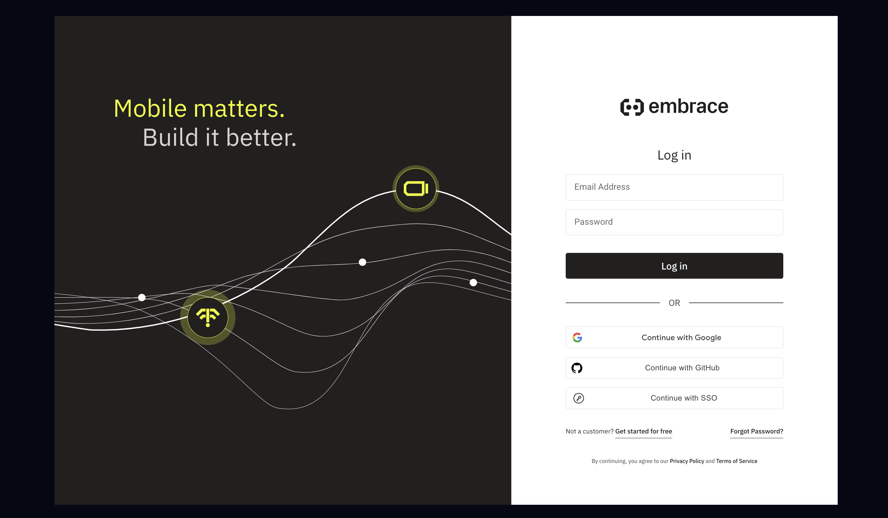

# Create an Embrace account

To start sending telemetry to , you'll need to create an  account.

Open your browser and navigate to [**dash.embrace.io**](https://dash.embrace.io).

 

If your organization already has an account that you've been invited to, you can use the specified login method that you've been invited with: Email, Google, GitHub, or SSO.

If you or your organization do not yet have an account, you can sign up for a generous free tier by tapping ["Get started for free"](https://dash.embrace.io/signup). For more information about the pricing and tiers of Embrace usage, please see the Embrace [pricing page](https://embrace.io/pricing/).