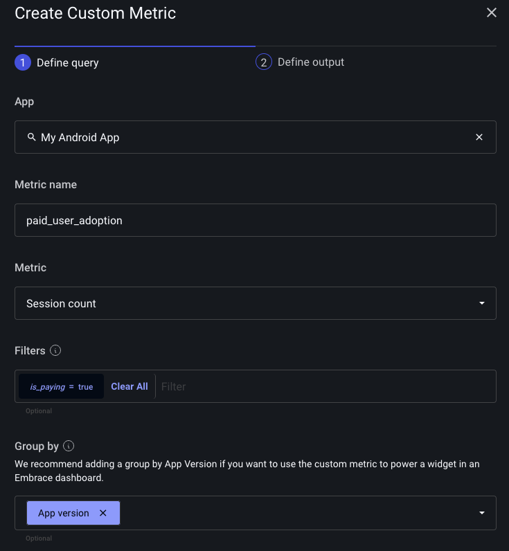
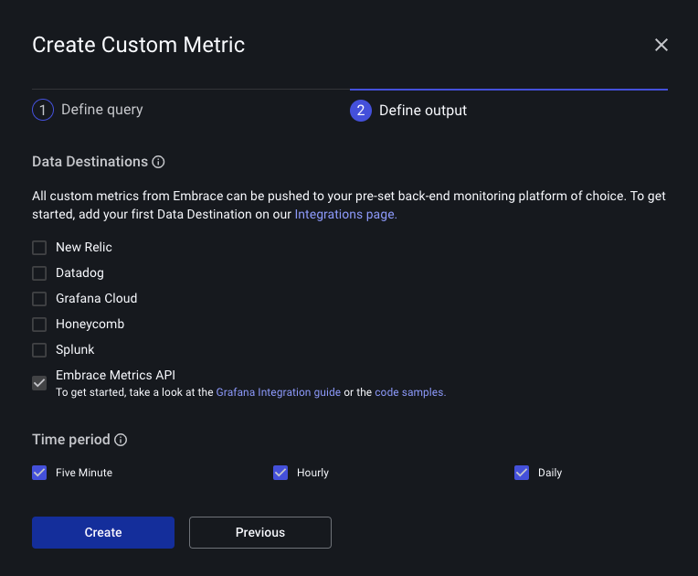

# View and create metrics in Embrace dashboard

Without aggregation, you might be missing the big picture about your app's user base and performance. That's why Embrace delivers certain Standard Metrics out of the box in your dashboard, and allows you to create Custom Metrics from a wide range of dimensions, filters, and groupings.

Currently, all metrics are delivered in five minute, hourly, or daily granularities.

## Standard Metrics

Each app in the Embrace dash will have a certain number of pre-created metrics that are important, universal indicators of app health. These are useful for common golden signals like app adoption over several app versions.The Standard Metrics available at the creation of your app are:
- `crashes_total`: Number of crashes
- `sessions_total`: Number of sessions
- `users_total`: Number of unique users

Each of these is filterable by app version, OS version, and device model. Combined with the different time granularities delivered, Standard Metrics are already a diverse and helpful aggregation of your app's activity.

## Custom Metrics

However, Standard Metrics are only the beginning of finding out about your app at scale. Using Custom Metrics, you can construct the most important dimensions and define your own time series metrics with custom labels. This feature enables you to create specific metrics that suit your unique needs, beyond the default metrics provided.

For example, you can define a session property to identify sessions associated with paying customers and filter for that session property to get app adoption amongst paying customers. You can then consume this metric in your observability backend of choice, such as Grafana, using the [Metrics API](./../../data-forwarding/metrics-api/).

### Creating Custom Metrics

Go to the "Settings" page in the Embrace dashboard and click on the "Custom Metrics" tab. Here you can create, view, and delete custom metrics. 

When you define a custom metric, you can specify:

- Metric - The aggregation you want to track.
- Name - The name of the metric. Must conform to the Prometheus spec.
- Filter - (Optional) Aggregate only a subset of the data.
- Group By - (Optional) Group the data by a set of dimensions. These will become the labels in your timeseries data.

After defining a custom metric you must select a Data Destination. You can choose amongst our existing integrations, or you can select the Embrace Metrics API and query the data from there.

