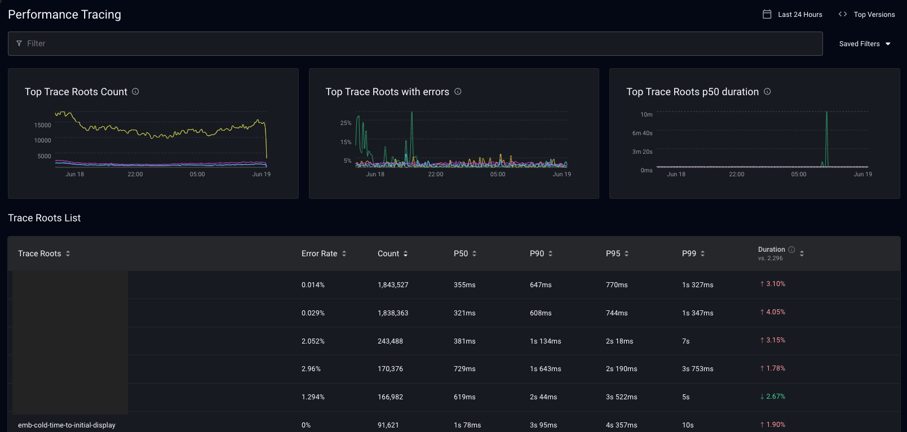
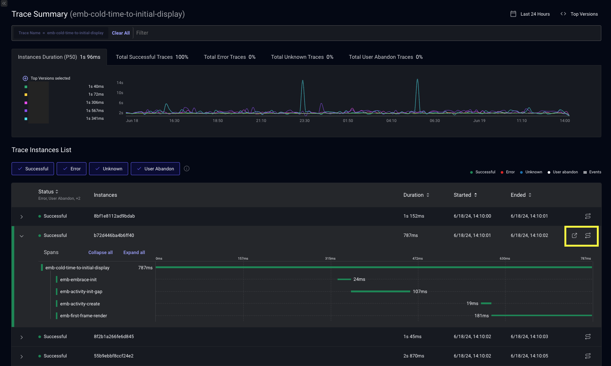
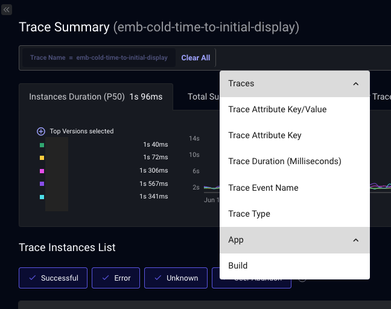
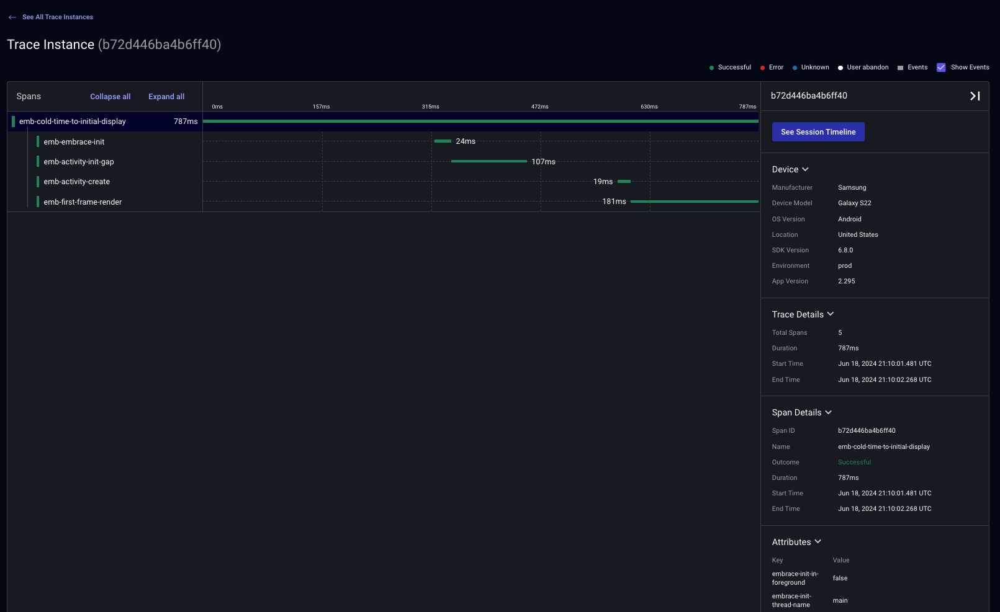

# Observe your most important user flows with Performance Tracing

Embrace’s Performance Tracing solution gives you visibility into any app operation you’d like to track, including duration, success rate, and any contextual metadata collected at runtime that helps debug the root cause of your mobile app's performance issues. With our tool, you can quickly spot any bottlenecks in your app’s architecture, pinpoint areas you need to troubleshoot with high precision, and ultimately deliver a truly optimized user experience.

In the Embrace Android and Apple SDKs, tracing is built on top of OpenTelemetry and [can be exported to Grafana](./../../mobile-signals/opentelemetry-signals/exporting-signals/). However, note that Performance Tracing is not presently a form of distributed tracing, and so does not tie directly to other services.

## Trace Roots

The primary page shows all root traces in your app, as well as summary metrics like count, error rate, percentiles of duration, and change from previous version.

 

To narrow down the instances that are summarized in this view, you can apply the following filters on the root span as well as the child spans:

- Name
- Duration
- Outcome
- Attributes keys and values
- Span event names

## Trace Summary

By clicking on the name of a Trace Root in the Trace Roots view, you can see a partial listing of all the instances of that trace.

Each row represents a specific instance of that trace being recorded. You can see its status, unique Span ID, duration, in addition to start and end times. All of these columns other than the Span ID is sortable.

Clicking on the instance will open up an in-line preview of the details of that instance, including the child spans that it has, their duration, and whether they completed successfully.

On the right side each row that shows a trace instance, there are two icons. The first one takes you to the Trace Instance View, where you can see all the details about that instance, including attributes and events on each child span. The second one takes you to the specific session in the User Timeline view that this instance ended in so you can see the full context of what happened before and after this trace was recorded.

 

 You can filter by the same properties as in the Trace Roots View. In fact, the filters that you had set on the Trace Roots View will apply if you navigate here from there directly.

 

## Trace Instance

This view show a trace in its entirety. Not only can you see all the information in trace instance preview, you can also see at the individual events and attributes recorded as part of on a each child span, along with metadata about the device and app.

 

 ## Summary

 A full set of Performance Tracing uses can be found on the [Embrace feature page](https://embrace.io/docs/features/performance-tracing/).