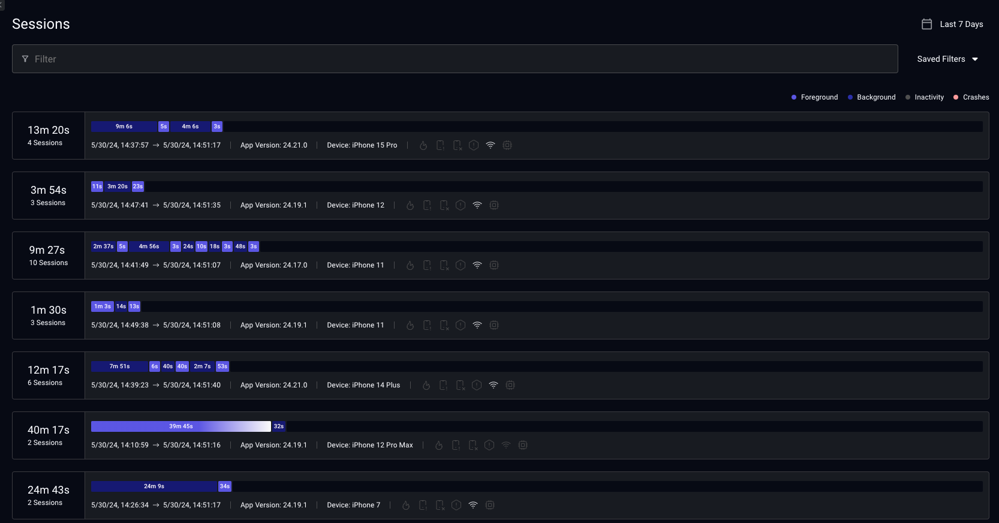
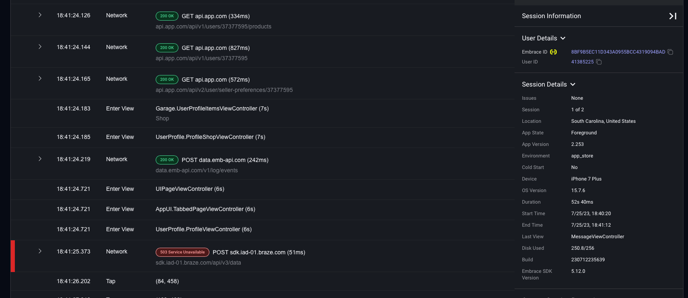
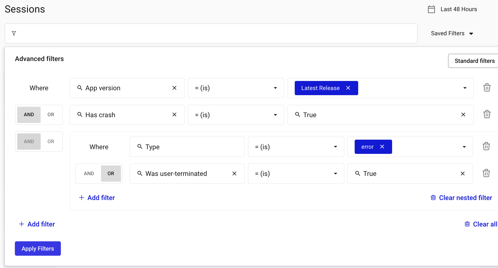

# Follow user journeys with User Session Insights

Experience every user interaction with real production-level data seamlessly. Embrace captures every user interaction, network request, and crash in real-time, providing you with comprehensive insights into your users' experiences.

The user timeline offers a granular view of each user's session, showcasing every interaction, network request, and crash.

## Horizontal Timeline

The horizontal timeline provides an overview of the session, highlighting different events such as network requests, crashes, and user interactions. Hovering over the timeline reveals details of activities at specific times. You can customize your view by filtering out events as per your preference.

 

Clicking on any event directs you to the Timeline Details.

## Timeline Details

The timeline details table presents an ordered list of every event within the timeline. Expandable rows provide additional information about each event. Clicking "See Impact" navigates you to the details page for that specific event.

 

## Filtering Sessions

Embrace provides an easy UI for querying your Sessions. Sessions are displayed from most recent, with summary statistics, issue indicators, and background/foreground context.

To find Sessions matching specific conditions, Embrace provides a variety of fields for filtering.

Major dimensions include properties for:

- App
- Device
- User
- Session
- Spans
- Logs
- Crashes
- ANRs

### Advanced Filters

For complex logic, you can activate Advanced Filters. This allows you to combine various conditions:

- You can chain logic using `AND/OR`. 
- You can nest components. 
- You can chain nested components, and nest chained components.

 