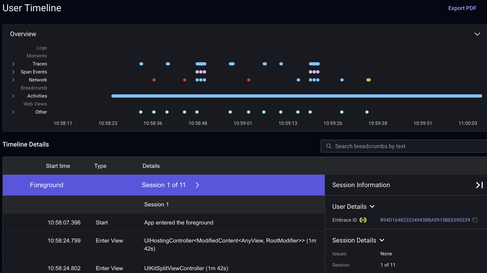

# Track all user activity using user sessions

## User sessions

 builds its SDKs to track the aspects of user experience that directly translate to performance. At its core, user experience is the time that they spend in your mobile app, that is, the user session.

 captures every event and user interaction with real production-level data, providing you with comprehensive insights in the [User Session Timeline](https://embrace.io/docs/features/user-session-insights/):

## What is in a session?

Everything the user does from the time they launch the app to the time they stop using the app is automatically tracked in a session, including details about:
- **interactions** like screen views, button presses, and taps
- **technical events** like network calls and errors
- **device state** like CPU, memory, battery, and connectivity
- **session outcomes** like foregrounding/backgrounding, crashes, and ANRs

Additionally, developers can add instrumentation like [traces](./../opentelemetry-signals/traces/) to assess the performance of the key user flows in their apps.

For more information about what you can do with user sessions, see [User session insights](./../../insights/user-session-insights/)